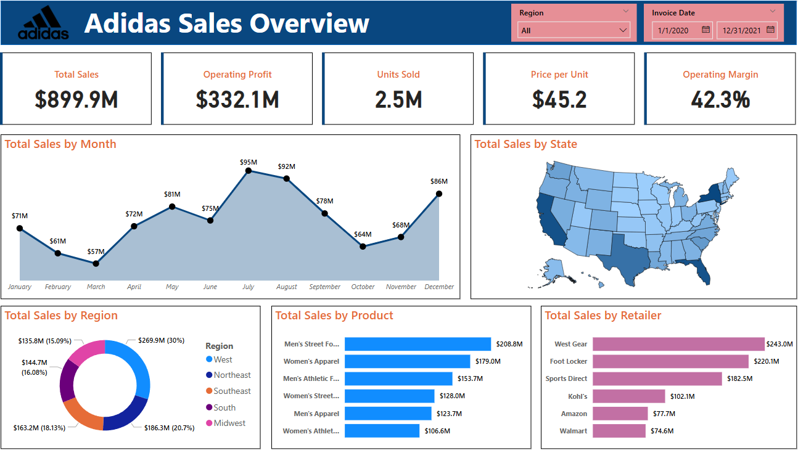

# Adidas Sales Overview Dashboard
In this project, I analyzed a dummy adidas US sales dataset to simulate Adidas business performance. Using Microsoft Power BI, I built an interactive dashboard to visualize total sales, profit, units sold, price per unit, and sales distribution by month, region, state, product, and retailer. This dashboard helps monitor sales trends and supports data-driven business decisions.

## 📌 Dataset
- **Source:** [dummy adidas US sales dataset](https://docs.google.com/spreadsheets/d/1-Mr4ptRUknFWRHHBXvEvsxdCUWCIx79d/edit?usp=sharing&ouid=117806829244204349758&rtpof=true&sd=true)
- **Description:** This dataset includes information on sales revenue, profit, number of units sold, sales channels, product categories, and regional breakdowns. It helps analyze business growth and sales distribution across the United States.

## 🧰 Tools
- **Power BI**: Used to create visual reports and build interactive dashboards  
- **Power Query**: Helps in shaping and preparing the data before analysis  
- **DAX**: Used for defining custom calculations and deriving insights through measures and formulas  
- **Excel**: Serves as the initial platform for storing and organizing raw data

## 📊 Key Metrics & Visuals

- **Total Sales**
- **Operating Profit**
- **Units Sold**  
- **Price per Unit** 
- **Operating Margin**
- **Total Sales by Month**
- **Total Sales by Region**
- **Total Sales by State**  
- **Total Sales by Product**
- **Total Sales by Retailer**

## 📈 Dashboard Preview

> 📁 Open the `.pbix` file in Power BI Desktop to explore the interactive dashboard

## 📖 How to Use

1. Clone this repository or download the `.pbix` file  
2. Open it using **Power BI Desktop**  
3. Connect it to your dataset or modify queries/measures to suit your organization  
